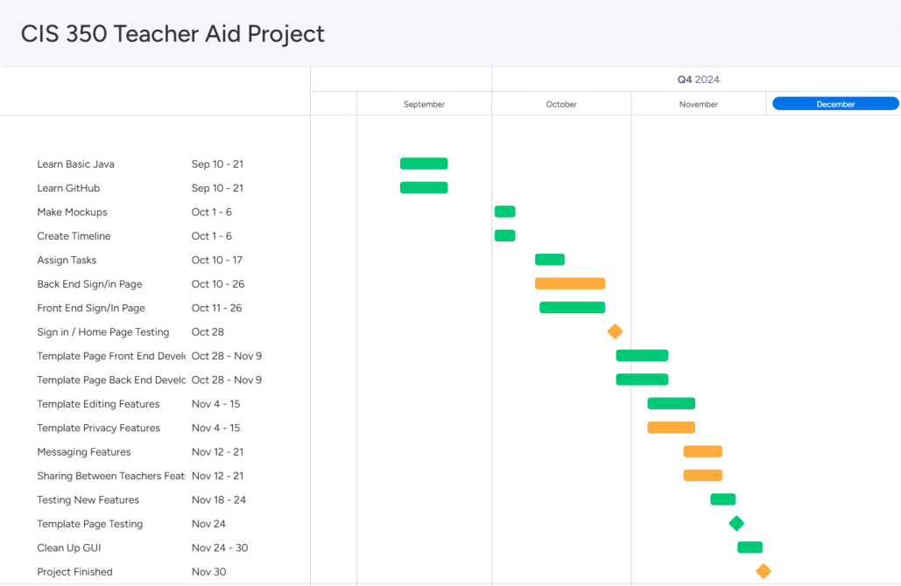
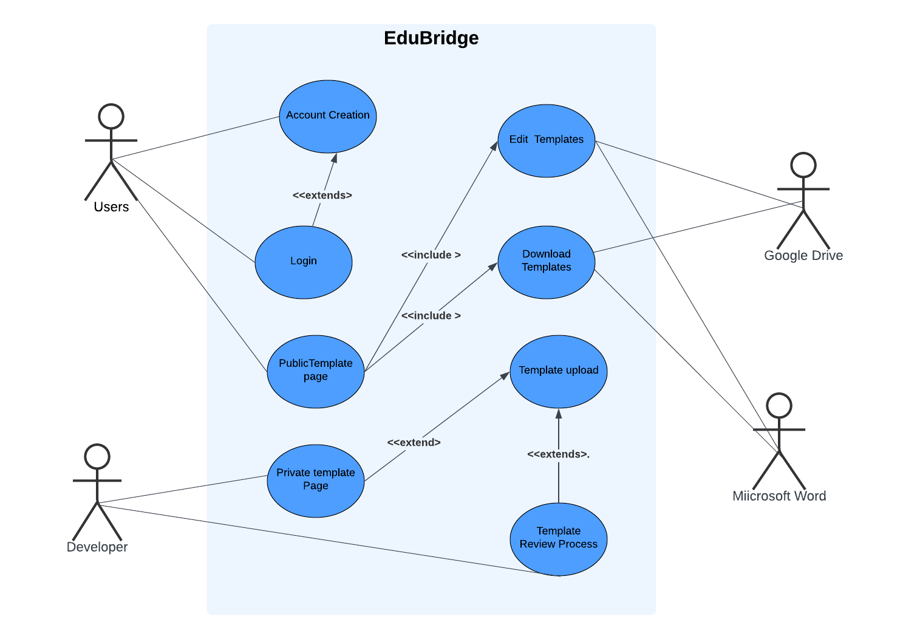
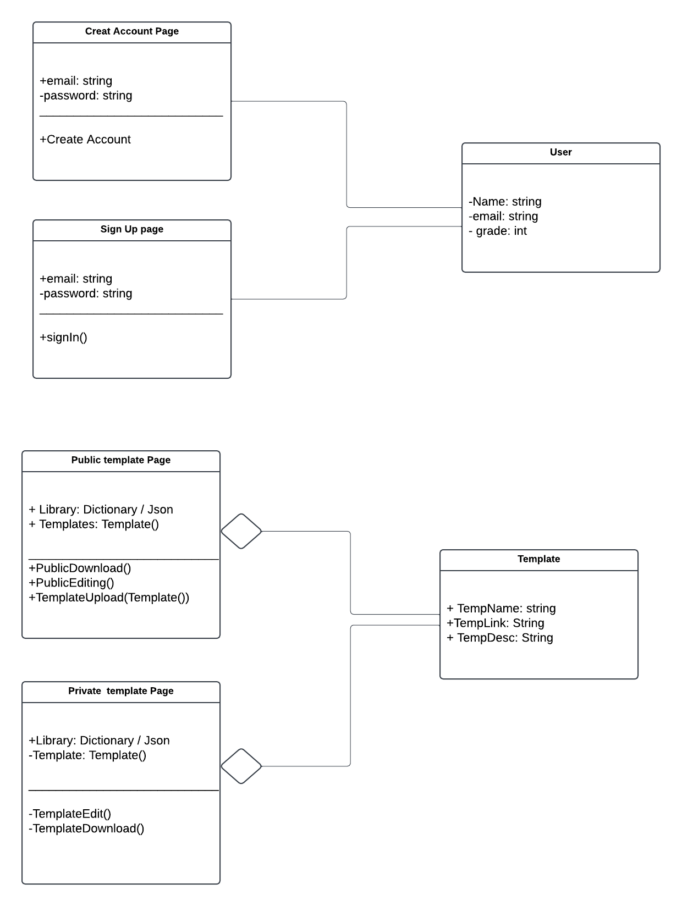
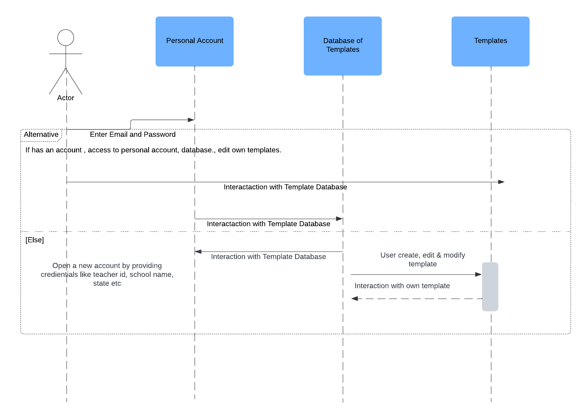
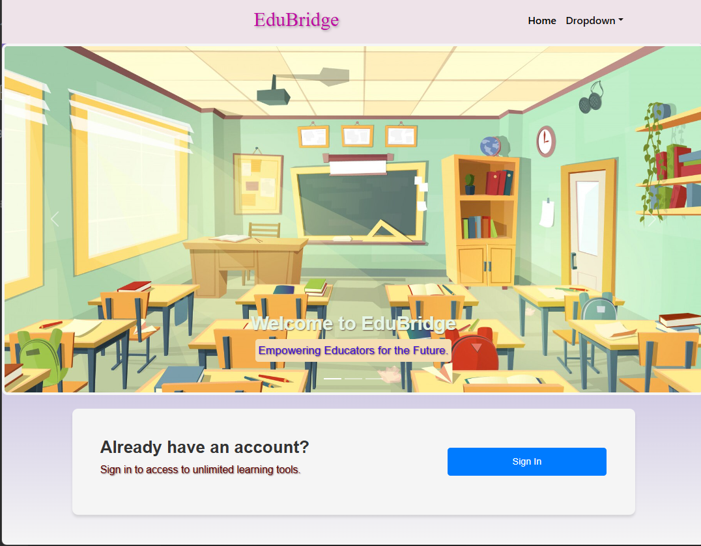

# Overview
This document will go over the requirements and artifacts from the "CluelessTeam's" CIS 350 Project website: EduBridge. It will describe both functional and non-functional requirements of EduBridge. As well as artifacts including, a sequence diagram, a use case diagram, and more. This document will conclude with a demo showcasing the current functionality and progress of EduBridge.
   
# Software Requirements
This section includes both Functional and Non-Functional requirements for features of the EduBridge website. 

## Functional Requirements

### Public Template Page
| ID | Requirement |
| :-------------: | :----------: |
| FR1 | This feature should provide the users a description of a specific template and category to inform the reader the purpose of each template|i
| FR2 | The public template page needs to include buttons that give the option to download or edit a template |
| FR3 | This feature should present the templates in a 3-by-X grid form where each row has 3 templates and X columns that adjust for the number of templates avaliable at the given time in it's stadard View form |
| FR4 | The public template page needs to give a preview of templates, when either the Word or Doc buttons are used |

### Edubrige Home Page
| ID | Requirement |
| :-------------: | :----------: |
| FR5 | This page should provide an inviting interface to keep users engaged with the website and create a welcoming virtual enviroment |
| FR6 | The Home Page should have a clear indication of the website's nagivation bar labelled "Dropdown"  |
| FR7 | The feature should include multiple images that parallel a teaching environment, which aims to interest the intended users |
| FR8 | The feature should provide a clear and noticeable button to sign-up for a website account under the rotation of images|

### Create Account Page
| ID | Requirement |
| :-------------: | :----------: |
| FR9 | This page should have clear indications of fields needed to be filled out in order for a user to create an account for the EduBridge website |
| FR10 | The sign up button should finalize the account creation process for the user |

### Sign in Page
| ID | Requirement |
| :-------------: | :----------: |
| FR11 | This page should have clear indications of fields needed to be filled out in order for a user to sign into their account for the EduBridge website |
| FR12 | Once the sign in button is clicked it should provide a "registration succesfull" message to the user so they can confirm they are in their account |
| FR13 | The sign up button should return the message "Please Try Again" if any of the filled out fields have incorrect data |

### Private Template Page 
| ID | Requirement | 
| :-------------: | :----------: |
| FR14 | The private template page should have clear indications of fields that need to be filled out so a template of the user's own creation can be considered for addition to EduBridge Public Templates |
| FR15 | Once "upload template" button is clicked all filled out fields should be stored to a .json file for the template review process |

### Navigation Bar
| ID | Requirement |
| :-------------: | :----------: |
| FR16 | The navigation bar labelled "Dropdown" when clicked should show buttons "Start", "Public Template", "Private Template"|
| FR17 | The navigation bar should provide users with a succesful way to traverse from the websites pages which are indicated by their respective names |   

## Non-Functional Requirements

### Public Template Page
| ID | Requirement |
| :-------------: | :----------: |
| NFR1 | The public template pages needs to have some type of connection to Google Drive in order to be edited on on Google Documents |
| NFR2 | This feature needs to be able to also have some type of connection to Word documents to be edited on Microsoft Word |
| NFR3 | This feature needs to be able to updated when a new template is created or given permission to be uploaded to the website |
| NFR4 | The Public template page shall adjust to different screen sizes including smaller ones (like phone sized screens) and present each template card with all information despite size changes |

### Edubrige Home Page
| ID | Requirement |
| :-------------: | :----------: |
| NFR5 | The webiste home page shoud establish links to other pages via the naviagation bar "Dropdown" |
| NFR6 | The Home Page needs to ensure the "sign up" button has a link to traverse users to the sign up page |
| NFR7 | The buttons should have travel time between pages less than 10 seconds|
| NFR8 | The Images on the Home page should adjust to screen size changes from user and keep the rotation effect while in a minimized screen |

### Create An Account Page
| ID | Requirement |
| :-------------: | :----------: |
| NFR9 | When the sign up button is clicked the data entered should store users data into the MongoDB database for later usage |
| NFR10 | The system should take common types of emails such as @gmail.com, @outlook.com, @icloud.com, but other emails may cause issues in signup process|

### Sign in Page
| ID | Requirement |
| :-------------: | :----------: |
| NFR11 | After the "sign in" button is clicked the website should take the inputs and confirm that match an account in the MongoDB database |
| NFR12 | The system shouldn't give access to a user's specific templates, if the sign up process was unsuccessful |

### Private Template Page
| ID | Requirement | 
| :-------------: | :----------: | 
| NFR13 | The private tempate page should be able to accept at least a Google Doc or Microsoft Word verisions of a template. Other forms of templates are not accepted for the upload to Public Template pages process at this time | 
| NFR14 | This feature for uploading a template is not yet on a automatic scale, and instead is a manual process to ensure templates are appropriate for the website |                                                                                
### Navigation Bar
| ID | Requirement |
| :-------------: | :----------: |  
| NFR15 | If the size of user's screen is minimized, the dropdown button should then appear as a hamburger bar for easier readiblity |
| NFR16 | The navigation bar should transfer users to each page possible in less than 10 seconds |

# Software Artifacts
This section will show of Artifacts from EduBridge's Development including documentation of progress we made throughout the project and diagrams that explain features of the project

## Gantt Chart
This gantt chart shows a more basic skeleton of the progress we made throughout the semester. The yellow items are features we could need get too or did not finish with the time period we had
 

## Use Case Diagram 
The Use case diagram shows many of the different objects we have and how they may interact or be used by actors

## Object Diagram
The object diagram shows a few of the relationships different objects have with each other at a given time in EduBridge

## Sequence Diagram
The sequence diagram shows possible interactions or "messages" between objects in EduBridge

# Demo 
The following is a visual Demo using images to show the features of EduBridge in full

### Home Page
The following shows of the Home Page we were able to create for EduBridge, you can use the Sign In button if you have an account or the dropdown for other navigation options. 

## Sign-in page
The Sign In Page can be used if you already have an account and want to log back in.

## Public template page
In the public template page we can view each template according to their category and download them.

## Word Transfer 

## Doc Transfer 

## Private template page
The private template page is actually a form to post a template by individual user. In the future, a user can also view a list of uploaded templates of their own creation and modify them.

